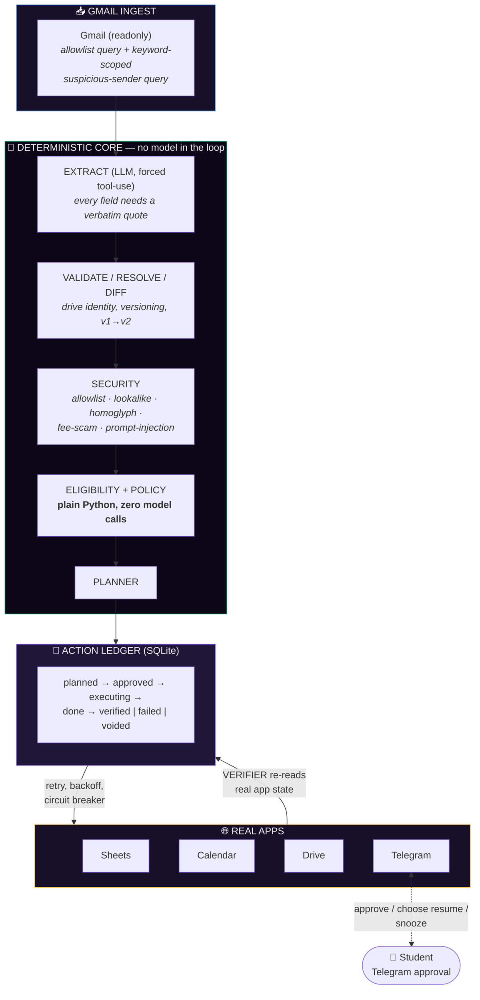
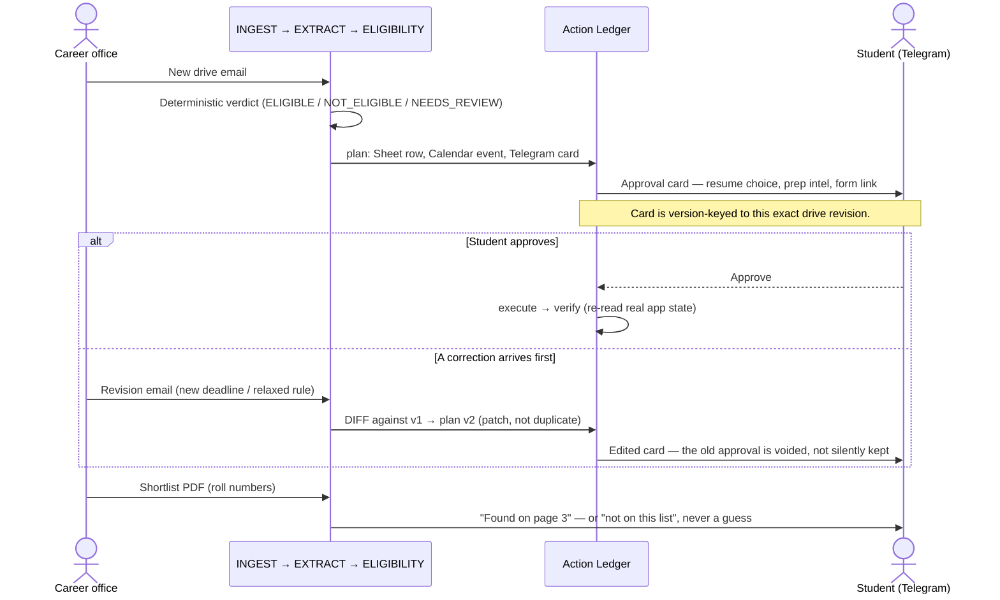
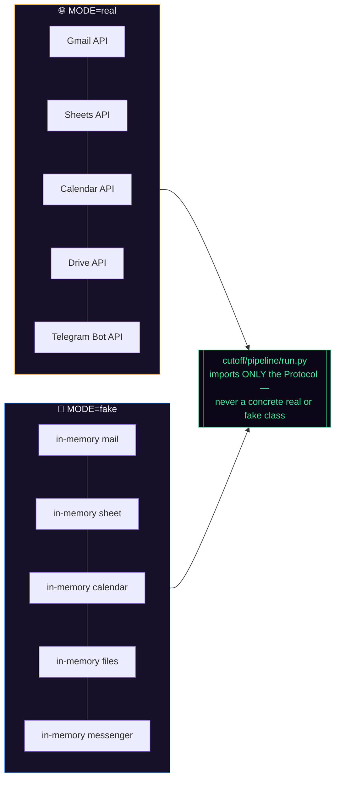
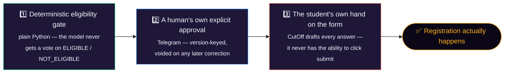

<div align="center">

# ✂️ CutOff

### The agent that never lets a student miss a campus recruiting drive they qualify for — or register for one they don't

**One deterministic decision core. Five real external apps. One human who always presses submit.**

*Built for the Multi-App AI Agent Hackathon — hosted by Lemma × Comma Capital, judged by the founders of Arga Labs*

[](#-how-we-tested-reliability)
[](#-tech-stack)
[](#-tech-stack)
[](#-external-apps-used)
[](#license)

</div>

<br>

> A "cutoff" is the one number every Indian student in recruiting season actually watches — the GPA line, the branch list, the midnight deadline. Miss the wrong one and you don't get a second try.
> This is the agent that watches all of them for you, and never crosses the one line it isn't allowed to: pressing submit on your behalf.

<br>

## The one-sentence pitch

Every recruiting season, a college "career office" fires eligibility-gated, deadline-driven emails at its entire student body — correction on top of correction, real fraud mixed in — and a single missed or misread one can cost a student the rest of their season. **CutOff reads every one of those emails, decides eligibility the same way every time using plain deterministic rules, keeps Calendar and a tracker Sheet honest as drives change underneath it, and drafts the entire registration — then stops, and asks a human on Telegram before anything irreversible happens.**

<br>

## Table of contents

- [Project overview](#-project-overview)
- [The core insight](#-the-core-insight)
- [External apps used](#-external-apps-used)
- [Architecture](#-architecture)
- [The drive lifecycle](#-the-drive-lifecycle)
- [One core, two worlds: real accounts and fake accounts](#-one-core-two-worlds-real-accounts-and-fake-accounts)
- [The differentiator: grade the outcome, not the transcript](#-the-differentiator-grade-the-outcome-not-the-transcript)
- [Reaching a student who has walked away](#-reaching-a-student-who-has-walked-away)
- [The registration boundary: three checkpoints, none optional](#-the-registration-boundary-three-checkpoints-none-optional)
- [What's genuinely real vs. honestly out of scope](#-whats-genuinely-real-vs-honestly-out-of-scope)
- [Tech stack](#-tech-stack)
- [Setup instructions](#-setup-instructions)
- [Project structure](#-project-structure)
- [How we tested reliability](#-how-we-tested-reliability)
- [Known gaps, stated plainly](#-known-gaps-stated-plainly)
- [Demo](#-demo)

<br>

## 🎯 Project overview

In the US this is on-campus recruiting season — career fairs, OCR sign-ups, a portal you check once a week. In India it runs almost entirely through email, at a scale most outside the system never see: roughly a million and a half engineering students graduate every year, and nearly all of them go through some version of this.

Every college has a "career office" (locally, the "placement cell") that emails the whole student body — sometimes several times a day — about company recruiting drives: the role, a hard eligibility bar (minimum GPA, allowed majors, zero failed courses outstanding), and a registration deadline that's frequently the same night.

Then come the corrections. A deadline moves. A GPA cutoff quietly changes. A drive gets cancelled and re-announced under a slightly different subject line. A shortlist PDF lands with four hundred roll numbers in no particular order. And mixed in with all of it: real fraud — fake "registration processing fee" requests and lookalike-domain emails built to look exactly like the real career office.

A student who misses one of these emails misses the drive. A student who registers for one they're not actually eligible for can, at many colleges, be barred from every drive for the rest of the season. There is no undo button on either mistake.

**What CutOff actually does, one drive, start to finish:**

1. **Reads** the student's Gmail for career-office mail — new drives, corrections, cancellations, reminders, shortlist PDFs — and always resolves to the *latest* version of a drive, even across three or four revisions of the same posting.
2. **Extracts facts, never judgment.** An LLM turns the email into structured data (company, role, GPA cutoff, allowed majors, deadline) — forced tool-use only, and every field it fills in must carry a verbatim quote from the email as evidence. It never decides anything.
3. **Checks eligibility deterministically.** Plain Python compares those facts against the student's real profile and the college's actual policy (both live in a Google Sheet the student controls). No model in the loop, no "you're probably fine."
4. **Keeps Calendar and the tracker Sheet in sync** as the drive evolves, and flags a test/interview slot that clashes with the student's own exam timetable.
5. **Tailors a resume for this specific role** — the closest existing resume on file, or a freshly generated one built from a "master profile" assembled once from the student's résumé plus their live GitHub and LeetCode activity.
6. **Drafts the registration form's open-ended answers**, and a company- and role-specific **interview-prep briefing** pulled from real, live web search.
7. **Sends it all to the student on Telegram as one approval card, and waits.** The student can approve, ask for a different resume, or ignore it. CutOff never submits the form itself.
8. **Reports back** when a shortlist PDF arrives — scanned for the student's roll number, with the exact page it was found on.

Along the way, it's also watching for fraud — fee-request scams and lookalike-domain phishing — and never acts on either.

<br>

## 💡 The core insight

```
   THE LLM ONLY EXTRACTS. IT NEVER DECIDES, AND IT NEVER TOUCHES AN API.
```

Every fact CutOff acts on comes from one forced tool-use call whose only job is turning an email into structured data — and every field in that structure has to be backed by a verbatim quote from the source text or it gets nulled and flagged. Eligibility, deduplication, scheduling, and every single side effect downstream of that are plain, deterministic Python. A test asserts the pipeline's eligibility engine (`cutoff/pipeline/eligibility.py`) and its Telegram-facing approval planner never import an LLM client at all — not "the LLM is usually right," structurally incapable of being asked.

<br>

## 🔌 External apps used

Five real external apps, behind one action ledger — the hackathon's bar was three:

| App | API used | Scope | What CutOff does with it |
|---|---|---|---|
| **Gmail** | Gmail API | `gmail.readonly` — never send/modify | Polls for career-office mail, plus a second keyword-scoped query so a lookalike sender outside the allowlist still gets seen |
| **Google Sheets** | Sheets API | read/write | Source of truth for the student's profile and the college's policy; also the drive tracker + append-only action log |
| **Google Calendar** | Calendar API | read/write | Deadline reminders and test/interview slots, patched in place on revision, checked against the student's own exam timetable |
| **Google Drive** | Drive API | `drive.readonly` | Resume storage — CutOff selects, it never uploads or deletes |
| **Telegram** | Bot API (long-poll) | bot token | The one place a human sees a drive and the only place that can approve one — real inline buttons, real messages |

The LLM provider (Gemini / Anthropic / OpenRouter, swappable) is not counted above — by design, it never touches any of these APIs directly. Every write goes through the action ledger, never from LLM output.

<br>

## 🏗 Architecture



One process (`python -m cutoff.main`) runs three things: a FastAPI dashboard + JSON API, a worker thread that polls Gmail and drives the pipeline, and a Telegram thread that long-polls for button presses. Trace spans (every step, tool call, latency, error) feed the same dashboard.

Two subsystems sit on top of that core loop: **onboarding** (`cutoff/pipeline/profile_synthesize.py`) parses a résumé PDF and a live GitHub/LeetCode pull into a hand-editable `master_profile.yaml` — deterministically merged, deliberately *not* an LLM reconciliation — and **prep intel** (`cutoff/adapters/web_research.py`) synthesizes a company-specific interview-prep briefing from real web search, opt-in and off by default.

<br>

## 🔁 The drive lifecycle



Every arrow is its own row in an append-only action ledger — nothing is ever mutated in place and re-read as if it always looked that way.

<br>

## 🌗 One core, two worlds: real accounts and fake accounts



Every external app sits behind a Python `Protocol` (`cutoff/adapters/base.py`) with a `real` and a `fake` (in-memory) implementation. `cutoff/pipeline/run.py` and `cutoff/main.py` import only from `base.py` — never a concrete adapter — checkable by reading the imports at the top of either file. That's what lets 374 tests run the entire pipeline with zero network access, and it's the same switch (`MODE=real` / `MODE=fake`) that took this from "passes its own eval" to "ran live against a real Gmail inbox, a real Sheet, and a real Telegram chat," with no pipeline code changed in between.

<br>

## 🛡 The differentiator: grade the outcome, not the transcript

The team judging this — Arga Labs — builds sandboxes with stateful "twins" of real APIs and grades agents on **final service state** and **forbidden effects**, not on whether the transcript sounds confident. So that's exactly how CutOff grades itself, before anyone else ever ran it:

- **A labeled eval harness** (`eval/runner.py`) checks the fake apps' *final state* after a run — the right Sheet row, the right Calendar event, and *nothing extra* — against 35 hand-written dev scenarios and a 10-scenario **held-out split graded only three times all session**, never tuned against.
- **A chaos mode** injects 429s, 500s, and mid-run crash/restarts, and grades whether the ledger actually recovers or just claims to.
- **A verifier re-reads the real app state after every write** — an action isn't "done" because the code that sent it didn't throw, it's done because CutOff read it back.
- **Nothing is smoothed over.** [`docs/RELIABILITY_BRIEF.md`](docs/RELIABILITY_BRIEF.md) shows the actual run-by-run arc, including the runs that look *worse* than the baseline (a free-tier rate-limit hit mid-session, left in rather than deleted).

> *"We built the grading harness before we needed one — because the team judging us builds exactly that kind of harness for a living."*

<br>

## 📱 Reaching a student who has walked away

Nobody deploys an agent so they can sit and babysit it. Every real decision reaches the student on **Telegram**, with real inline buttons:

- **Every approval card is keyed to the exact drive revision it was generated for.** If a correction lands after the card is sent, the old card's approval is **voided**, not silently honored against stale terms — a student can never approve v1's eligibility and have v2's registration go out.
- **The resume choice is a genuine fork, not a default.** "Use what's on file" bypasses the LLM entirely; "generate one for this role" only ever falls back to the same safe default on failure, never to a lower-confidence guess.
- **Snooze, skip, and "mark submitted" are all first-class replies** — the approval flow assumes a student who is busy, not one sitting at their laptop.

<br>

## 🔐 The registration boundary: three checkpoints, none optional



There is no code path from an extracted email to a submitted registration that skips a human. Auto-submitting the form was explicitly cut from scope, not left out by accident — the one irreversible, debarment-risking action in this entire system always ends with a student's own thumb on the button.

<br>

## ✅ What's genuinely real vs. honestly out of scope

| | |
|---|---|
| ✅ **Real** | Gmail, Sheets, Calendar, Drive, and Telegram — all real API calls, all exercised live against real accounts during this build, not just in the fake-adapter eval |
| ✅ **Real** | The LLM extraction, resume-matching, and form-answer calls — real Gemini/Anthropic/OpenRouter requests in `MODE=real`; only the *test suite* stubs them, and it says so in every test file |
| ✅ **Real** | Onboarding's GitHub/LeetCode pull and the prep-intel web search — real, live, unofficial APIs (labelled as such in their own docstrings, since neither is an officially documented public API) |
| 🛑 **Deliberately out of scope, not a gap** | Auto-submitting the registration form — the one action this project refuses to automate, on purpose, discussed above |
| ⚠️ **Honest limitation** | A generated résumé's Drive link only resolves wherever the dashboard is actually reachable — `PUBLIC_BASE_URL` needs a real public tunnel to work from a recruiter's own Google Form, not just `127.0.0.1` |
| ⚠️ **Honest limitation** | Single student per running instance; college policy is entered by hand, not scraped |

Nothing here fakes a real credential or a real payment-shaped action to look more finished than it is — the fake adapters exist for hermetic testing, never to dress up a demo as something it isn't.

<br>

## 🧰 Tech stack

<table>
<tr>
<td valign="top">

**Backend**
- Python 3.11+ · FastAPI (async) + Uvicorn
- SQLite (WAL) — action ledger, trace spans, dedup
- Pydantic v2 — every model, every LLM tool schema
- Vanilla HTML/CSS/JS dashboard (no build step)

</td>
<td valign="top">

**External APIs**
- Gmail, Sheets, Calendar, Drive (`google-api-python-client`)
- Telegram Bot API — hand-rolled long-poll client
- Gemini / Anthropic / OpenRouter (swappable LLM provider)

</td>
<td valign="top">

**Document & search**
- `pdfplumber` — text **and** real hyperlink extraction
- `reportlab` — generated résumé PDFs
- `ddgs` — live web search for prep intel
- `rapidfuzz`, `dateparser` — fuzzy drive matching, date parsing

</td>
</tr>
</table>

<br>

## ⚙️ Setup instructions

Requires Python 3.11+.

```bash
pip install -e ".[dev]"
cp .env.example .env
```

Fill in `.env`. At minimum, for fake/demo mode, you need an LLM key — `GEMINI_API_KEY` is the easiest to get for free (no card) at [aistudio.google.com/apikey](https://aistudio.google.com/apikey); set `LLM_PROVIDER=gemini` and `LLM_MODEL` to match. See the comments in `.env.example` for the Anthropic and OpenRouter alternatives.

**Try it in under a minute, no real accounts needed:**

```bash
python -m cutoff.main
```

Open [http://127.0.0.1:8000](http://127.0.0.1:8000). In fake mode with `DEMO_MODE=1`, the dashboard has demo controls — send a test email, inject a correction, trigger chaos — with no Google or Telegram account required.

**For `MODE=real`** (actual Gmail/Sheets/Calendar/Drive/Telegram), you additionally need:

- A Google Cloud OAuth client (`credentials.json`) with Gmail (readonly), Sheets, Calendar, and Drive (readonly) scopes enabled, then:
  ```bash
  python scripts/google_auth.py
  ```
- A Google Sheet with Profile/Policy/Drives/Log/FormTemplates tabs — created and seeded automatically:
  ```bash
  python scripts/setup_sheet.py
  ```
- A Telegram bot token (`@BotFather`) and your chat ID, in `TELEGRAM_BOT_TOKEN` / `TELEGRAM_CHAT_ID`.
- Optionally, `python scripts/import_master_profile.py <resume.pdf>` to build the onboarding profile from the CLI instead of via Telegram.

To send a real test email to the account CutOff watches (from a separate "career office" sender account, never the agent's own credentials, which are `gmail.readonly` only):

```bash
python scripts/seed_inbox.py --to <student-email> --preset new_drive
```

<br>

## 📁 Project structure

```
cutoff/
  adapters/    real + fake implementations of every external app, one Protocol each
  llm/         extraction / resume-matching / form-answer / prep-intel prompts
  pipeline/    eligibility engine, planner, executor, form autofill, resume
               generation, onboarding synthesis
  app/         FastAPI server + dashboard (static/)
  bot/         Telegram long-poll handler + onboarding flow
  main.py      entrypoint: server + worker + Telegram threads
eval/          35 dev scenarios, 10 held-out, fixtures, runner, results, self-heal reports
scripts/       one-off setup and ops scripts (OAuth, sheet seeding, test-email sending,
               onboarding import, demo reset)
tests/         374-test pytest suite
docs/          RELIABILITY_BRIEF.md — the full, honest results arc
config/        master_profile.example.yaml template (the real one is gitignored)
```

<br>

## 🧪 How we tested reliability

**374 unit/integration tests** — every one against fake adapters and stubbed LLM responses, no test ever calls a real API or a real LLM. The ones that matter most:

- `test_grounding.py` — a hallucinated fact gets nulled and flagged, even when it's a small edit-distance away from something real (`test_hallucinated_number_is_rejected_even_though_its_a_small_edit_distance`, `test_fabricated_claim_built_from_common_words_is_rejected`)
- `test_security.py` — 34 tests including a **homoglyph-domain** phishing check (Cyrillic/Greek lookalike characters, not just Levenshtein distance) and fee-scam / prompt-injection detection
- `test_faults.py` — `test_crash_mid_run_recovers_with_zero_duplicates`, `test_duplicate_delivery_doubles_list_new_results` — the ledger's crash-recovery and dedup guarantees, not just its happy path
- `test_circuit_breaker.py` — the shared breaker never mutates state on a snapshot read, and opens exactly at threshold, not before or after

**On top of the unit suite, a labeled eval harness grades outcomes, not intentions**, pulled straight from the actual result files, not rounded:

| Split | Scenarios | Verdict acc. | Forbidden effects | Required effects | Scam recall |
|---|---|---|---|---|---|
| Dev | 35 | **100%** | **0** | 98.2% | 100% |
| Dev + `kitchen_sink` chaos (429s/500s/crash-restart) | 34 | **100%** | **0** | 92.6% (97.1% fault-recovery rate) | 100% |
| **Held-out** (written once, graded 3× all session, never tuned against) | 10 | **100%** | **0** | **100%** | 100% |

The dev split includes 3 scenarios added specifically to be hard: a multi-revision chain, two contradictory corrections in one thread, and a genuinely ambiguous two-drive resolution the system must refuse to guess on rather than silently pick one. All 3 pass. The two dev misses above (`dev_013`, `dev_024`) are a single known-intermittent revision-matching scenario — the eligibility verdict is still always correct and zero forbidden effects ever occur; see [`docs/RELIABILITY_BRIEF.md`](docs/RELIABILITY_BRIEF.md#known-limitations) for the honest reproduction data.

Every real bug found along the way is logged with root cause and fix, never quietly patched — [`NOTES.md`](NOTES.md) is a 38-entry, dated build log, and [`docs/RELIABILITY_BRIEF.md`](docs/RELIABILITY_BRIEF.md) tells the run-by-run arc including a homoglyph-domain detection gap, a reachability blind spot in the eval harness itself, a PDF-hyperlink extraction bug found via a real onboarding, and a live Google Sheet typo that crashed the worker with an unreadable error.

<br>

## 📋 Known gaps, stated plainly

- The one remaining flaky scenario (`dev_013`) shares a company/role overlap with a fix already applied, and involves thread-based revision matching across three overlapping mentions of the same word — not fully ruled out as residual sampling variance, not chased further given everything else already fixed.
- Scanned (image-only) PDF attachments aren't OCR'd.
- `RESUME_FOLDER_ID` and college policy are configured by hand, not verified against ownership or scraped automatically.
- The prep-intel web search and the GitHub/LeetCode pull both depend on unofficial endpoints — every failure there degrades to "no result shown," never a crash, and prep intel is opt-in (`ENABLE_PREP_INTEL=0` by default) for exactly this reason.
- Single student per running instance — no multi-tenant support.

<br>

## 🎬 Demo

📺 **[Watch the 2-minute demo](https://drive.google.com/file/d/1Z471IKQcqQ8N7Qk1jIderHBGYJ9UdXPr/view?usp=sharing)**

<br>

---

<div align="center">

### Built for the Multi-App AI Agent Hackathon · Lemma × Comma Capital · judged by Arga Labs

*Every eligibility call explainable and evidence-grounded. Every action recorded, retried, and verified. The one irreversible step always ends with the student's own hand.*

<br>

<a name="license"></a>
**License:** MIT

</div>
